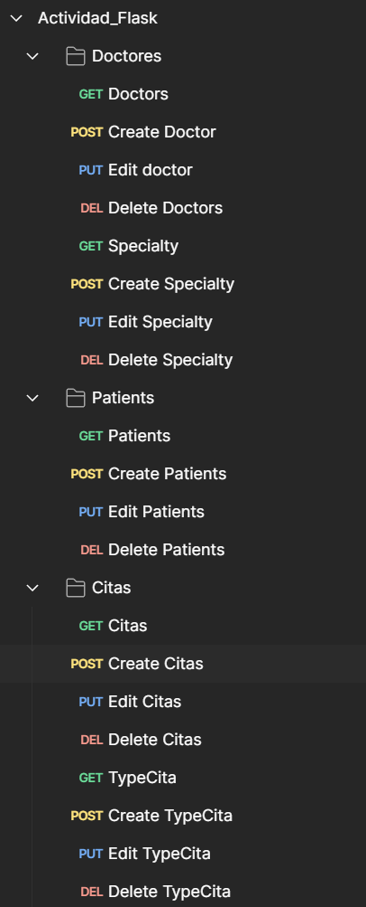
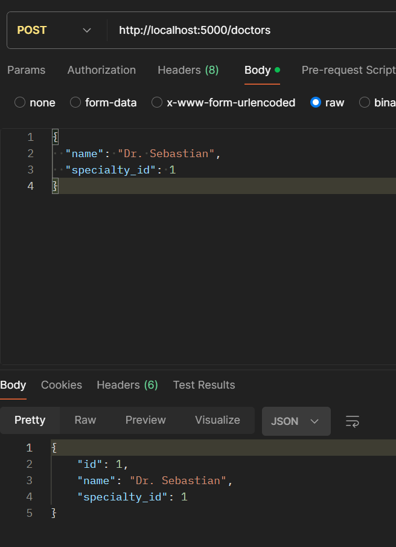
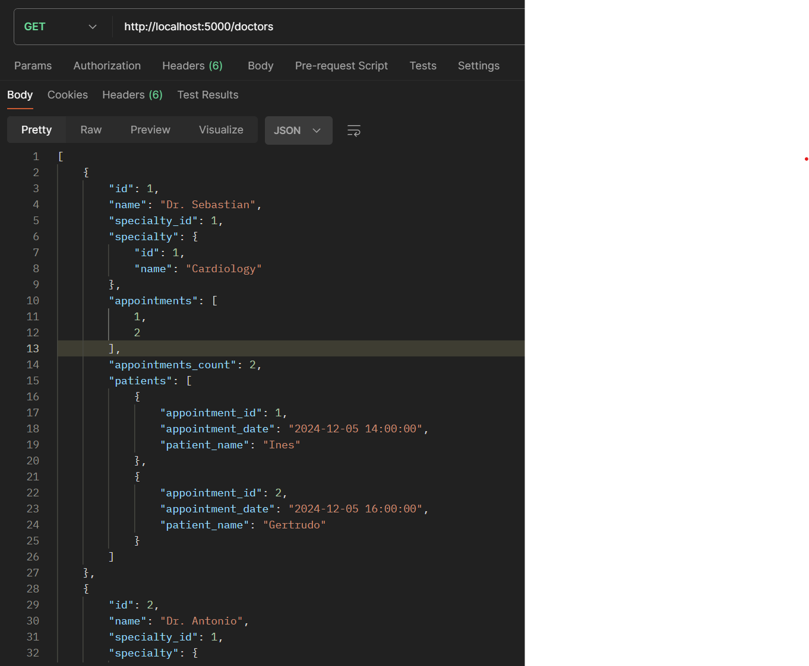
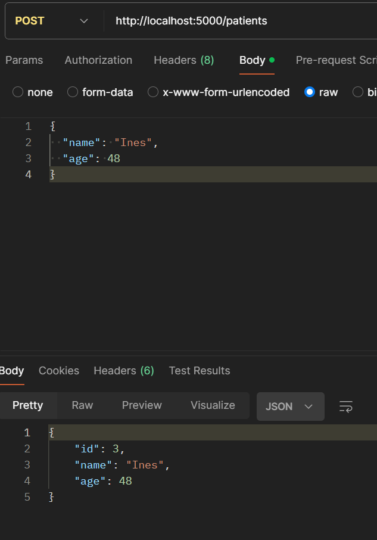
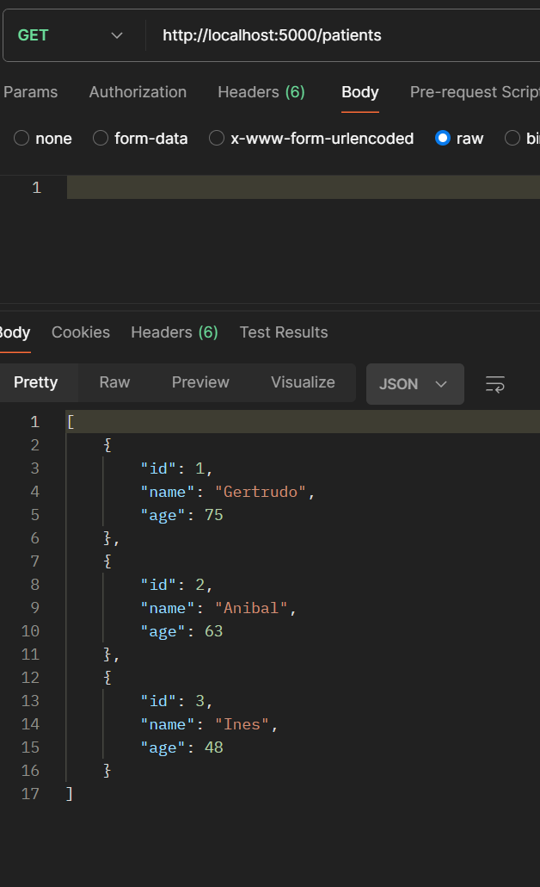
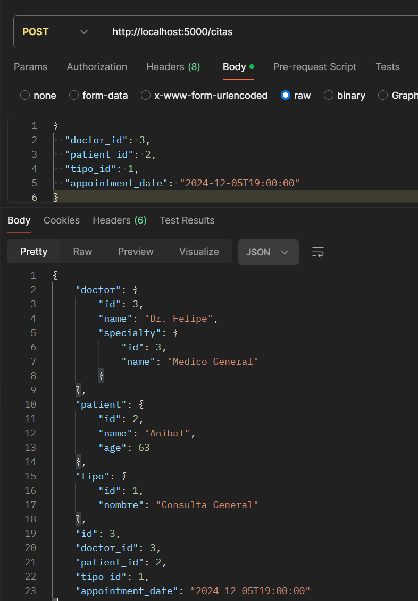
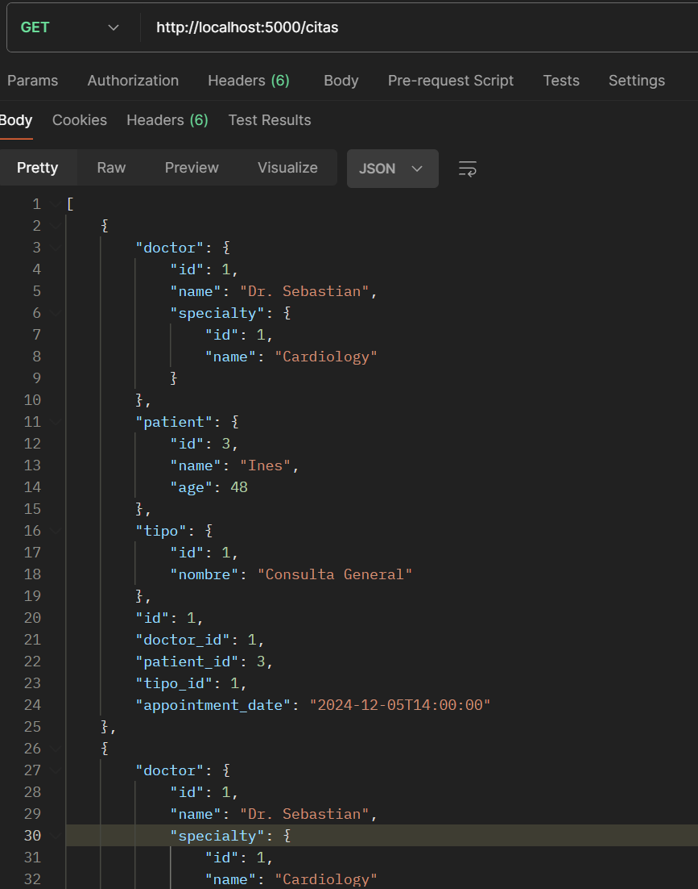

# Gestor de citas medicas

Este proyecto es un sistema de gestión de citas médicas desarrollado usando Flask, 
un micro-framework de Python. El sistema permite a los usuarios gestionar doctores, pacientes, 
citas y tipos de citas médicas, facilitando la interacción con la base de datos a través de una API RESTful.

## Instalación

### Requisitos Previos

- Python 3.8+
- pip
- virtualenv (opcional)

### Configuración del Entorno

1. Instalar `virtualenv` si aún no está instalado:

   ```bash
   pip install virtualenv

Instrucciones paso a paso de la instalacion despues del entorno.

      git clone https://github.com/SebasCar98/Gestor_de_citas.git
      cd tu-repositorio
      pip install -r requirements.txt
      flask run
   

## Stack Tecnologico

- Flask
- SQLAlchemy
- SQLite
- Flask-RESTful.

El sistema está diseñado para ser simple pero funcional, 
proporcionando una base robusta para cualquier expansión futura o 
personalización necesaria para adaptarse a diferentes requisitos o entornos de trabajo médicos.

## Evidencia de Funcionamiento

A continuación, se muestran algunas capturas de pantalla que demuestran el funcionamiento del sistema 
a través de Postman.

### Estructura de Postman para las pruebas.




### Solicitud de Creación de Doctor



### Solicitud get de Doctores



### Solicitud de Creación de Paciente



### Solicitud de get de Pacientes Creados.



### Solicitud de Creación de una cita



### Solicitud de get de Citas Creadas.




